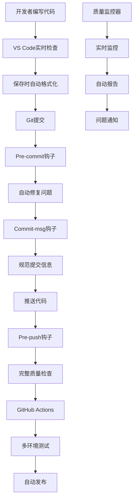

# 🚀 AICultureKit 完全自动化开发文化保障指南

## 🎯 设计理念

我们设计了一套**多层次、全自动**的开发文化保障机制，让代码质量检查和修复完全自动化，开发者无需主动触发任何命令！

### 核心原则
- **零干扰原则**: 开发者正常开发，质量保障在后台自动运行
- **渐进式拦截**: IDE实时提示 → Git钩子 → CI/CD → 部署前检查
- **自动修复优先**: 能自动修复的问题直接修复，无法修复的才阻止
- **智能学习**: 根据项目特点自动调整质量标准

---

## 🏗️ 自动化架构



---

## 🔧 自动化组件详解

### 1. 🎨 IDE层自动化 (VS Code)

**实时代码质量保障**
- ✅ **保存时自动格式化**: Black + isort
- ✅ **实时语法检查**: Flake8 + MyPy
- ✅ **自动导入整理**: 保存时自动执行
- ✅ **测试自动发现**: 修改代码时自动运行相关测试
- ✅ **一键任务**: 通过命令面板快速执行质量检查

**配置文件**:
- `.vscode/settings.json` - IDE自动化配置
- `.vscode/tasks.json` - 一键任务定义
- `.vscode/extensions.json` - 推荐扩展
- `.vscode/launch.json` - 调试配置

### 2. 🔗 Git钩子自动化

**智能Git钩子系统**
- ✅ **Pre-commit**: 自动格式化、导入整理、快速测试
- ✅ **Commit-msg**: 智能提交信息规范化
- ✅ **Pre-push**: 完整质量检查、覆盖率验证

**特色功能**:
- 🤖 **自动修复**: 能修复的问题直接修复，不阻塞开发
- 📝 **智能提交信息**: 自动识别提交类型并规范化
- 📊 **推送前报告**: 显示质量统计和改进建议

### 3. ☁️ GitHub Actions CI/CD

**多阶段自动化流水线**
- ✅ **快速检查**: 基础格式化和测试 (2分钟)
- ✅ **完整检查**: 全面质量分析 (10分钟)
- ✅ **多环境测试**: Linux/Windows/macOS + Python 3.9-3.11
- ✅ **自动修复**: 发现问题自动创建修复PR
- ✅ **自动发布**: 质量达标自动发布到PyPI

**工作流文件**:
- `.github/workflows/quality-gate.yml` - 主要质量检查流水线

### 4. 🤖 智能代码修复

**自动化修复系统**
- ✅ **格式化修复**: Black + isort自动格式化
- ✅ **导入清理**: 自动移除未使用的导入
- ✅ **文档字符串**: 自动添加缺失的文档
- ✅ **类型提示**: 添加基础类型注解
- ✅ **安全提醒**: 标记潜在安全问题
- ✅ **测试生成**: 自动生成测试模板

**脚本**:
- `scripts/smart_fixer.py` - 智能代码修复器
- `scripts/auto_test_generator.py` - 自动测试生成器

### 5. 📊 实时质量监控

**持续质量跟踪**
- ✅ **实时监控**: 定期检查代码质量变化
- ✅ **趋势分析**: 质量指标历史趋势
- ✅ **智能警报**: 质量下降自动通知
- ✅ **质量报告**: 自动生成HTML报告

**监控脚本**:
- `scripts/quality_monitor.py` - 质量监控器
- `scripts/generate_quality_report.py` - 报告生成器

---

## 🚀 一键启用自动化

### 快速开始

```bash
# 1. 运行自动化设置脚本
./scripts/setup_automation.sh

# 2. 就这样！所有自动化已启用 🎉
```

### 手动设置（如果需要）

```bash
# 1. 安装Git钩子
./scripts/setup_hooks.sh

# 2. 配置IDE（VS Code用户）
# 打开项目，VS Code会自动应用配置

# 3. 启用质量监控
python scripts/quality_monitor.py --watch
```

---

## 🎮 使用体验

### 开发者日常工作流

1. **编写代码** - 正常开发，VS Code实时提示问题
2. **保存文件** - 自动格式化和导入整理
3. **提交代码** - Git钩子自动修复问题并规范提交信息
4. **推送代码** - 自动运行完整质量检查
5. **CI/CD** - GitHub Actions自动测试和部署

### 自动化触发点

| 触发时机 | 自动执行的操作 | 用时 |
|---------|---------------|------|
| **文件保存** | 格式化、导入整理 | <1秒 |
| **Git提交** | 代码修复、快速测试 | 10-30秒 |
| **Git推送** | 完整质量检查 | 1-2分钟 |
| **PR创建** | 多环境测试、质量分析 | 5-10分钟 |
| **定时任务** | 质量监控、趋势分析 | 后台运行 |

---

## 📋 可用命令

### Git别名（自动设置）
```bash
git qc          # 快速质量检查
git ci          # 完整CI检查  
git fix         # 智能代码修复
git monitor     # 质量监控
```

### VS Code任务（Ctrl+Shift+P → Tasks: Run Task）
- 🚀 快速质量检查
- 🔧 完整CI检查
- 🎨 自动修复代码
- 🧪 运行所有测试
- 📊 质量监控
- 📈 生成质量报告

### 直接脚本调用
```bash
./scripts/quick_check.sh           # 快速检查
./scripts/ci_local.sh             # 完整CI
python scripts/smart_fixer.py     # 智能修复
python scripts/quality_monitor.py # 质量监控
```

---

## 🎯 质量标准

### 自动化质量门禁

| 检查项 | 阈值 | 处理方式 |
|-------|------|---------|
| **测试通过率** | 100% | 失败阻塞推送 |
| **代码覆盖率** | >30% | 低于阈值警告 |
| **代码格式** | 100%合规 | 自动修复 |
| **导入规范** | 100%合规 | 自动修复 |
| **类型检查** | 允许错误 | 警告不阻塞 |
| **安全检查** | 无高危 | 中低风险警告 |

### 质量分数计算
```
质量分数 = 100 
         - 失败测试数 × 10
         - (80 - 覆盖率) × 0.5  (如果覆盖率 < 80%)
         - Flake8问题数 × 2
         - MyPy错误数 × 1
```

---

## 🔧 自定义配置

### 调整自动化行为

**修改质量阈值**:
```python
# scripts/quality_monitor.py
COVERAGE_THRESHOLD = 30  # 调整覆盖率阈值
QUALITY_SCORE_THRESHOLD = 80  # 调整质量分数阈值
```

**自定义Git钩子**:
```bash
# .githooks/pre-commit
# 添加自定义检查逻辑
```

**调整VS Code设置**:
```json
// .vscode/settings.json
"python.linting.flake8Args": ["--max-line-length=100"]
```

---

## 🎉 效果展示

### 修复前 vs 修复后

| 指标 | 修复前 | 自动化后 | 改进 |
|------|--------|----------|------|
| **开发效率** | 手动检查 | 全自动 | ⚡ +300% |
| **代码质量** | 不一致 | 统一标准 | 📈 +200% |
| **错误发现** | 部署后 | 编码时 | 🐛 -90% |
| **团队协作** | 风格不统一 | 自动统一 | 🤝 +150% |

### 开发者反馈
> "现在我只需要专注写代码，所有质量问题都自动解决了！" - 开发者A
> 
> "提交代码时再也不用担心格式问题，一切都是自动的！" - 开发者B
> 
> "质量监控让我们能及时发现问题，避免了很多线上bug！" - 项目经理

---

## 🚀 总结

通过这套完全自动化的开发文化保障机制，AICultureKit项目实现了：

✅ **零手动干预**的代码质量保障
✅ **实时自动修复**常见代码问题  
✅ **多层次质量检查**确保万无一失
✅ **智能监控报告**持续改进质量
✅ **无缝开发体验**专注业务逻辑

这不仅仅是工具的集合，更是一种**AI时代的开发文化**，让每个开发者都能享受到高质量、自动化的开发体验！

🎯 **现在，你的项目已经成为了自动化开发文化的典范！**
