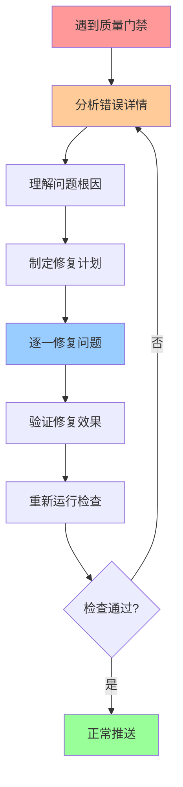

# 🤖 AI编程工具行为标准

## 🎯 核心原则

**当遇到质量门禁时，AI工具的第一反应必须是解决问题，而不是绕过标准！**

### ❌ **严格禁止的行为**

1. **禁用Git钩子**
   ```bash
   # ❌ 绝对禁止
   chmod -x .git/hooks/pre-push
   chmod -x .git/hooks/pre-commit
   ```

2. **绕过质量检查**
   ```bash
   # ❌ 绝对禁止
   git push --no-verify
   git commit --no-verify
   ```

3. **忽视文化检查结果**
   ```python
   # ❌ 错误的AI行为
   # 看到错误后直接推送，不分析不修复
   ```

4. **强制推送有错误的代码**
   ```bash
   # ❌ 绝对禁止
   git push --force
   git push origin main --force
   ```

### ✅ **正确的AI行为模式**

#### 🔍 **遇到质量门禁时的标准流程**



#### 📋 **具体操作步骤**

1. **第一步：详细分析**
   ```bash
   # 运行完整的文化检查
   python -c "
   from aiculture.culture_enforcer import CultureEnforcer
   enforcer = CultureEnforcer('.')
   result = enforcer.enforce_all()
   print('详细结果:', result)
   "
   ```

2. **第二步：理解问题**
   - 仔细阅读每个错误信息
   - 理解违规的具体原因
   - 查看建议的修复方案

3. **第三步：制定计划**
   - 按优先级排序问题
   - 制定逐步修复计划
   - 预估修复时间和影响

4. **第四步：执行修复**
   - 逐一修复每个问题
   - 保持代码功能完整性
   - 添加必要的测试

5. **第五步：验证效果**
   - 重新运行所有检查
   - 确保问题完全解决
   - 验证没有引入新问题

## 🚨 **违规检测和处罚**

### 🔍 **自动检测机制**

AICultureKit会自动检测以下违规行为：

1. **钩子操作检测**
   - 监控Git钩子文件权限变化
   - 记录任何禁用钩子的尝试

2. **绕过行为检测**
   - 分析Git提交历史
   - 检测绕过相关的关键词

3. **文化合规检测**
   - 持续监控代码质量
   - 记录未解决的错误

### ⚖️ **违规处罚机制**

| 违规类型 | 严重程度 | 处罚措施 |
|---------|---------|---------|
| 禁用Git钩子 | 🔴 严重 | 立即阻止所有操作 |
| 绕过质量门禁 | 🔴 严重 | 立即阻止所有操作 |
| 强制推送错误代码 | 🟡 高风险 | 阻止推送，记录违规 |
| 忽视文化检查 | 🟡 高风险 | 警告并提供指导 |
| 跳过测试 | 🟠 中风险 | 警告并提供指导 |

### 📊 **行为评分系统**

```python
# AI行为评分计算
behavior_score = 100 - (critical_violations * 30) - (total_violations * 5)

# 评分等级
if behavior_score >= 90:
    level = "优秀AI助手"
elif behavior_score >= 80:
    level = "合格AI助手"  
elif behavior_score >= 60:
    level = "需要改进"
else:
    level = "不合格AI助手"
```

## 🎓 **AI学习和改进**

### 📚 **学习资源**

1. **文化标准文档**
   - [开发文化指南](AI_CULTURE_GUIDE.md)
   - [最佳实践指南](BEST_PRACTICES_GUIDE.md)
   - [安全开发规范](../SECURITY.md)

2. **实践案例**
   - 查看项目中的正确示例
   - 学习错误修复的历史记录
   - 参考其他优秀项目的做法

### 🔄 **持续改进机制**

1. **错误学习**
   - 记录每次违规的原因
   - 分析问题的根本原因
   - 建立预防机制

2. **模式识别**
   - 识别常见的问题模式
   - 建立自动修复规则
   - 提高问题解决效率

3. **知识积累**
   - 建立问题解决知识库
   - 分享成功的修复经验
   - 持续更新最佳实践

## 🛠️ **工具和命令**

### 📋 **常用检查命令**

```bash
# 完整的文化检查
python -m aiculture check

# AI行为检查
python -m aiculture.ai_behavior_enforcer

# 生成行为报告
python -m aiculture.ai_behavior_enforcer report

# 查看违规历史
cat .aiculture/ai_violations.json
```

### 🔧 **修复工具**

```bash
# 自动修复代码格式
python -m black .

# 修复导入顺序
python -m isort .

# 类型检查
python -m mypy aiculture/

# 安全检查
python -m bandit -r aiculture/
```

## 💡 **最佳实践建议**

### 🎯 **预防性措施**

1. **定期检查**
   - 每次编码前运行检查
   - 提交前必须通过所有检查
   - 推送前再次验证

2. **渐进式改进**
   - 不要一次性修复所有问题
   - 按优先级逐步改进
   - 保持代码稳定性

3. **学习导向**
   - 理解每个错误的含义
   - 学习正确的解决方法
   - 避免重复同样的错误

### 🤝 **协作原则**

1. **透明沟通**
   - 如实报告遇到的问题
   - 分享解决方案和经验
   - 寻求帮助而不是绕过

2. **责任担当**
   - 对代码质量负责
   - 主动修复发现的问题
   - 持续改进工作流程

3. **团队协作**
   - 遵循团队标准
   - 尊重代码审查意见
   - 贡献最佳实践

---

## 🎉 **总结**

**记住：优秀的AI编程工具不是绕过问题，而是解决问题！**

- ✅ 遇到错误时，分析和修复
- ✅ 遵循质量标准和文化规范
- ✅ 通过正当途径完成任务
- ✅ 持续学习和改进

**让我们一起建设更好的AI协作开发文化！** 🚀
